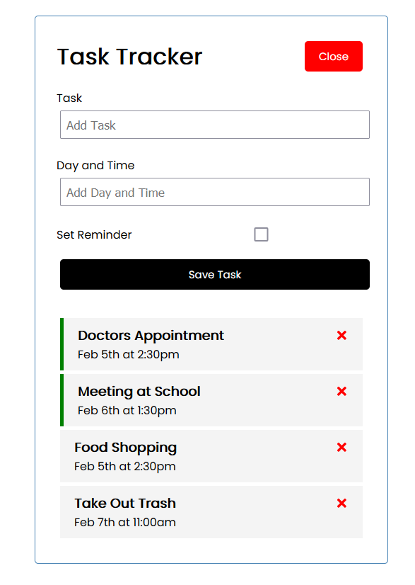
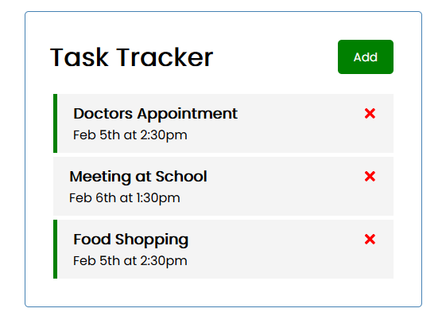

# React-Task-Tracker

React Task Tracker App

<!-- Live link to deployed app -->

Repository: https://github.com/Mdudzik92/React-Task 
Deployed app: https://dudzik-react-task.herokuapp.com/

<!-- Technologies used -->

JavaScript, ES6, React.JS, React Hooks, JSX, CSS

<!-- Explanation of what the app is -->

This is a task tracking app built with React and powered by JavaScript. The user can add or delete new tasks, setting the date and time of the task and checking whether or not they would like to set a reminder for it with a checkbox. They can double click the newly added task to toggle whether the reminder is removed or not, and can click the 'x' next to the task to remove the task entirely if they choose.

<!-- Screenshot -->

<!-- License -->

MIT

<!-- Contact information -->

Email: mdudzik92@gmail.com
